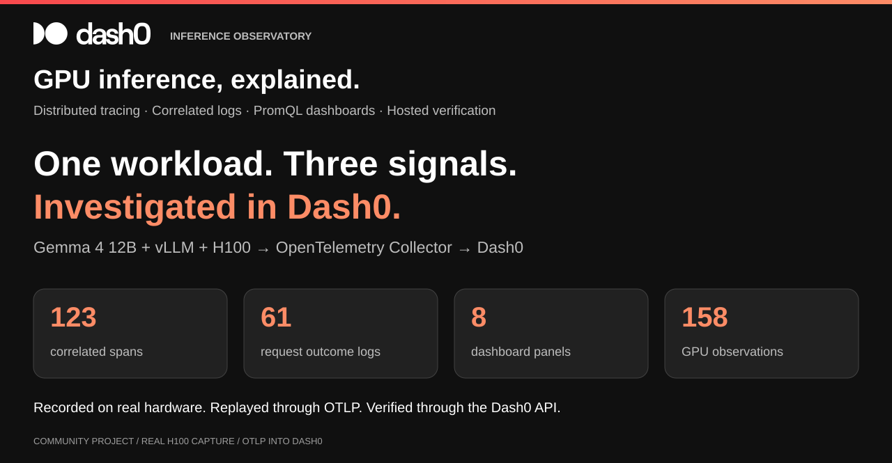
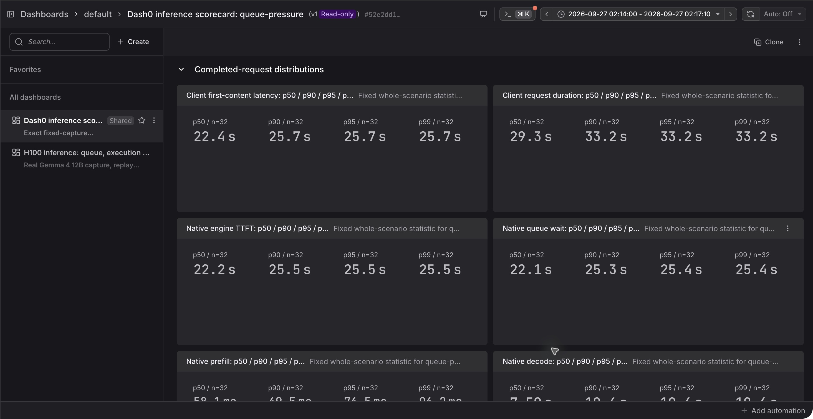
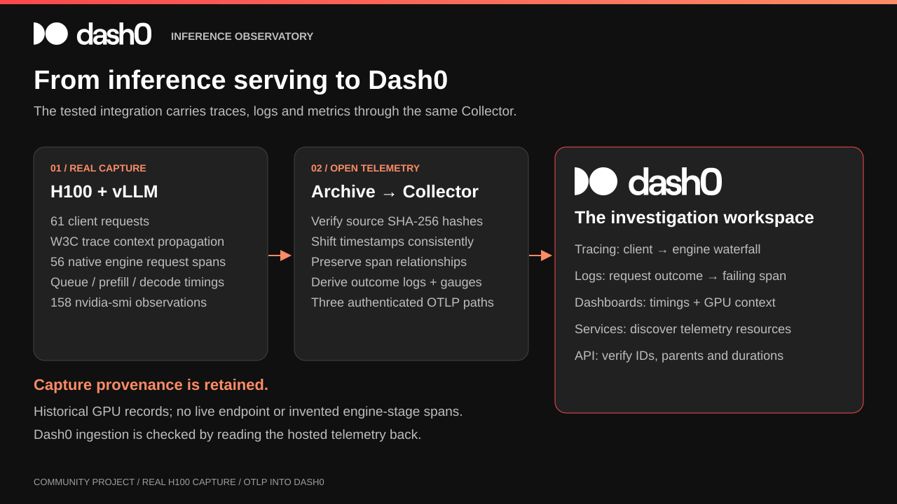

# GPU Inference Observability with Dash0

[](https://www.dash0.com/)

**An end-to-end Dash0 integration for investigating GPU inference: from the serving layer to traces, correlated logs and GPU dashboards.**

Built with [Dash0](https://www.dash0.com/), OpenTelemetry and vLLM. Dash0 is the investigation workspace throughout this project: discover services, follow distributed traces, pivot from logs to failing requests, and compare engine timings with GPU measurements. This is an independent community project.

This lab follows a Gemma 4 12B workload served by vLLM on one H100 80GB. The GPU run is preserved as an immutable archive. We replay its traces and recorded measurements through an OpenTelemetry Collector into Dash0, then investigate why requests waited, what failed, and how the GPU behaved.


The animation uses actual Dash0 screenshots with zoomed excerpts and highlights. These are time-shifted records of real inference, not a new GPU run. [Static screenshots](docs/assets/dash0/) remain available for closer inspection.

## Dash0 integration at a glance

| Dash0 capability | What you can investigate here | Implementation / evidence |
|---|---|---|
| OpenTelemetry ingestion | Traces, logs and metrics through authenticated OTLP | [Collector pipelines](collector/replay.yaml) |
| Distributed tracing | Client requests linked to native vLLM spans, with queue, prefill and decode attributes | [Latency walkthrough](#why-was-inference-slow) |
| Correlated logs | Request outcomes with a direct path to the failing client span | [Failure walkthrough](#what-failed) |
| PromQL dashboards | Eight panels for client latency, engine timings and recorded GPU measurements | [Dashboard as code](scripts/replay/dashboard.py) |
| Service discovery | Application and engine resources in the Services view | [Resource walkthrough](#gpu-and-service-context) |
| Public API | Read hosted telemetry back and verify identities, relationships and durations | [Hosted verifier](scripts/replay/verify_dash0.py) |

Start with the [Dash0 setup guide](docs/dash0-replay.md), then follow the [investigation guide](docs/investigations.md). For the product itself, see [Dash0 documentation](https://www.dash0.com/docs) and the [Dash0 API](https://www.dash0.com/docs/api-reference/openapi.json).

## What the integration proves

| Evidence | Verified result |
|---|---:|
| Workload | 61 requests across six scenarios |
| Completed generation | 56 requests |
| Expected rejection | 1 HTTP 400 |
| Intentional early stream closure | 4 requests, final usage unavailable |
| Distributed traces | 6 traces, 123 spans |
| Native vLLM request spans | 56, each linked to its original client parent |
| Correlated outcome logs | 61, derived from archived request records |
| GPU observations | 158 recorded samples, five measurements per sample |
| Prepared OTLP metric data points | 1,079, including client and native timing observations |
| Completed-request tokens | 53,742 input; 11,264 output |

Hosted verification reads the data back through Dash0's public API. It compares **every span ID, parent ID and duration** with the prepared OTLP payload, checks the error's exception event, and verifies all 61 log-to-span correlations. [Verification result](docs/evidence/dash0-hosted-verification.json) · [Replay manifest](docs/evidence/dash0-manifest.json)

## TTFT, percentiles and inference throughput

The [inference metrics walkthrough](docs/inference-metrics.md) covers client first-content latency, native engine TTFT, p50/p90/p95/p99, queue/prefill/decode timings, per-request mean ITL, request rates and input/output token throughput. It includes the exact source fields, formulas, Dash0 queries and setup commands, plus a separate live-vLLM histogram/scrape guide.

The new **12-panel Dash0 inference scorecard** complements the original eight-panel investigation dashboard. Its [251 aggregate statistics were verified through the Dash0 API](docs/evidence/inference-scorecard-verification.json). Values describe the captured workload; no GPU is running now.

| Scenario | Completed | First-content p50 | p90 | p95 | p99 | Output tokens/s |
|---|---:|---:|---:|---:|---:|---:|
| Baseline | 8 | 0.193 s | 0.282 s | 0.282 s | 0.282 s | 39.22 |
| Queue pressure | 32 | 22.436 s | 25.681 s | 25.681 s | 25.694 s | 130.87 |
| Long context | 8 | 0.660 s | 3.977 s | 3.977 s | 3.977 s | 54.44 |
| Recovery | 8 | 0.189 s | 0.254 s | 0.254 s | 0.254 s | 39.34 |

Percentiles use nearest rank over completed requests. Throughput divides final output tokens by scenario wall time, accounting for overlapping requests. Eight-request p90/p95/p99 all select the maximum. Workloads differ in output length and concurrency; this is diagnostic accounting, not a hardware benchmark.

[Open the Dash0 scorecard (organization login required)](https://app.dash0.com/dashboards?org=9554a420-a7db-45da-99a8-ca786f8fa8c0&s=eJxljjGuwjAQRO-ydfzZGBIU1_8EiIpu492AJceOYpsmyt0xDRKinTczehscwGzAlClJBgMsExWfoYEp2pKEr26WC4W7gAnF-0_-X1bKLoZvtsa5nmjUvcJB6fMVB9OeDOIfIt7qa46__GzaD080L96Fe20R05LdU2Bv4MCUHmOkldPb17tUZTeIiwQweS3SgOO66bRo5pZUf-wmdaJRK7L2qMTSIL3tRrQt7Pv-Ane1S6M%3D)



Dash0’s [documented sharing controls](https://www.dash0.com/docs/dash0/dashboards/control-sharing-and-access) grant access to users, roles and teams. The account’s access panel shows Admin/Edit and Member/Read; no anonymous public-sharing option was found. The screenshot, results and dashboard JSON below are public and require no Dash0 account. Hosted data remains subject to account retention.

[Full percentile and throughput tables](docs/evidence/inference-scorecard.md) · [Importable scorecard](dashboards/perses/inference-scorecard-queue-pressure.json)

## Why was inference slow?

Queue pressure sent 16 concurrent requests to an engine scheduling at most four sequences. A selected native request spent **23.046 s in queue, 0.053 s in prefill and 6.108 s in decode**. Its total engine duration was 29.218 s. Queueing explains most of that request's latency.

A long-context request had a different profile: **3.444 s in prefill and 0.000056 s in queue**. Treating both cases as “slow inference” would conceal the distinction between admission delay and prompt processing.

| Scenario | Calls | Concurrency | p95 client first content | p95 native queue | p95 native prefill |
|---|---:|---:|---:|---:|---:|
| Baseline | 8 | 1 | 0.282 s | 0.053 ms | 57.48 ms |
| Queue pressure | 32 | 16 | 25.681 s | 25.379 s | 76.48 ms |
| Long context | 8 | 2 | 3.977 s | 0.056 ms | 3.444 s |
| Recovery | 8 | 1 | 0.254 s | 0.058 ms | 52.72 ms |

These are nearest-rank percentiles from small diagnostic samples, calculated from the [original records](docs/evidence/gemma4-h100-run.json). They are not Dash0 histogram estimates or a throughput benchmark. Client time includes network/SSH transport. Percentiles in different columns can belong to different requests and must not be added. Queue pressure also used longer outputs than baseline; this was a contention test, not an isolated concurrency comparison.

## What failed?


The rejected request asked for 9,000 output tokens against the configured 8,192-token limit. The client recorded `BadRequestError`, HTTP 400 and an error span. The request failed before generation. This capture does not establish a mid-stream engine failure.

Four other requests deliberately stopped consuming after five content chunks. Their outcome is `intentional_early_close`, not completed generation. Final token usage remains missing. No native child span was captured for those four requests, so this evidence cannot establish server-side cancellation timing.

## GPU and service context


The dashboard has eight panels covering client first-content time, request duration, engine queue, prefill/decode, GPU utilization, allocated memory, power and temperature. Its PromQL uses **15-second rolling maxima of recorded observations**. These charts are not p95s, and gaps do not imply zero. This bounded window also prevents Prometheus's usual lookback from extending the last request measurement into an apparently live plateau.

GPU measurements came from `nvidia-smi`, not DCGM. Allocated memory includes model and KV-cache reservations; it is not a measurement of occupied KV-cache blocks. The 100% utilization peak is real, but its presence alone does not identify the cause of a particular slow request.

Dash0's Services view counts entry spans: **56 engine requests and six workload roots**. It is not the authoritative count of the 61 client calls. Use the correlated request logs or the workload manifest for completion/error rates.

## Architecture: inference serving into Dash0



The original workload opened a client span around the entire streamed response and propagated W3C `traceparent` to vLLM. vLLM emitted native `llm_request` spans with queue, prefill and decode statistics. Both sides exported OTLP to a local archive receiver through SSH tunnels; Logfire was the first destination for that capture.

This repository adds the tested Dash0 path:

1. Verify the source files against their SHA-256 manifest and select only the six main-workload traces.
2. Assign new trace IDs and shift every timestamp by one constant offset. Preserve span IDs, parent relationships, durations, events and original attributes.
3. Encode request outcome logs and timing/GPU gauges from the archived measurements, with explicit source labels.
4. Send OTLP/protobuf to a loopback Collector, which exports all three signals over authenticated TLS to Dash0.
5. Read the hosted data back before treating Collector acceptance as successful ingestion.

No queue/prefill/decode child spans are invented. Those measurements remain native span attributes, with derived gauges for charting. The original archive is unchanged.

[Integration details](docs/architecture.md) · [Dash0 setup and replay](docs/dash0-replay.md) · [Investigation guide and feature coverage](docs/investigations.md)

## Run the replay

Requires Python 3.12, Docker, Dash0 ingest/API access and a compatible capture directory. **The raw archive is kept outside this public repository**; the committed evidence contains summaries and screenshots. The capture format and original workload tools are linked in the [setup guide](docs/dash0-replay.md).

```bash
python3.12 -m venv .venv
. .venv/bin/activate
pip install -r scripts/replay/requirements.txt

# Copy your organization's regional endpoints from Dash0.
export DASH0_ENDPOINT='YOUR-GRPC-HOST:4317'
export DASH0_API_URL='https://YOUR-API-HOST'
export DASH0_DATASET='default'
read -rs DASH0_AUTH_TOKEN   # paste the existing token, then press Enter
export DASH0_AUTH_TOKEN

python scripts/replay/collector.py up
python scripts/replay/capture.py prepare \
  --archive /path/to/h100-capture \
  --output artifacts/my-replay --replay-id my-replay
python scripts/replay/capture.py send --output artifacts/my-replay
python scripts/replay/verify_dash0.py artifacts/my-replay
python scripts/replay/dashboard.py --replay-id my-replay --apply
python scripts/replay/collector.py down
```

Open Dash0's dashboard **H100 inference: queue, execution and GPU**. Set the time picker to `replay_window` from the generated manifest. In Logs and Tracing, filter `inference.replay.id = my-replay`. Built-in views can reset the time range, so check it after switching views. Ingestion can lag local acceptance; rerun the read-only verifier rather than sending the same payload again.

The Collector binds only `127.0.0.1:24318`. Credentials stay in environment variables or an ignored, permission-restricted local file. Sending is explicit, payload hashes are checked, and a send journal blocks accidental retries after ambiguous failures.

## Scope and next steps

Validated: vLLM 0.30.0, `google/gemma-4-12B-it`, BF16/text-only, one H100 80GB, context 8,192, four active sequences, eager execution, prefix caching disabled. Detailed tracing favors diagnosis and affects overhead.

This replay does not create a live inference endpoint. The repository's [optional simulator](docs/simulator.md), [GPU Compose example](docs/gpu-mode.md) and Kubernetes examples remain separate teaching/deployment paths. Their DCGM panels, alerts and synthetic failure scenarios were not exercised in this real capture. SGLang, TensorRT-LLM, multimodal requests, production SLOs and alert delivery need their own validation.

## Development

```bash
# Isolated replay tests; no GPU, account or private archive required.
.venv/bin/pytest -q tests/test_replay.py tests/test_inference_metrics.py

# Regenerate the animations from the committed Dash0 screenshots.
.venv/bin/python scripts/replay/build_walkthroughs.py
```

The existing simulator suite uses `tests/requirements.txt` in its own environment. CI runs the two dependency sets separately. No backend is contacted by unit tests.

## Built with Dash0

[Dash0](https://www.dash0.com/) provides the hosted observability experience shown in every walkthrough. The screenshots are actual Dash0 views of this workload; the diagrams and animation framing use a palette drawn from its official site. The Dash0 logo belongs to Dash0. [Visual sources and reproduction](docs/assets/dash0/README.md).

[MIT license](LICENSE)
