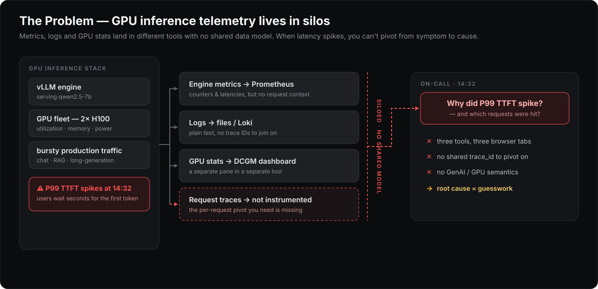
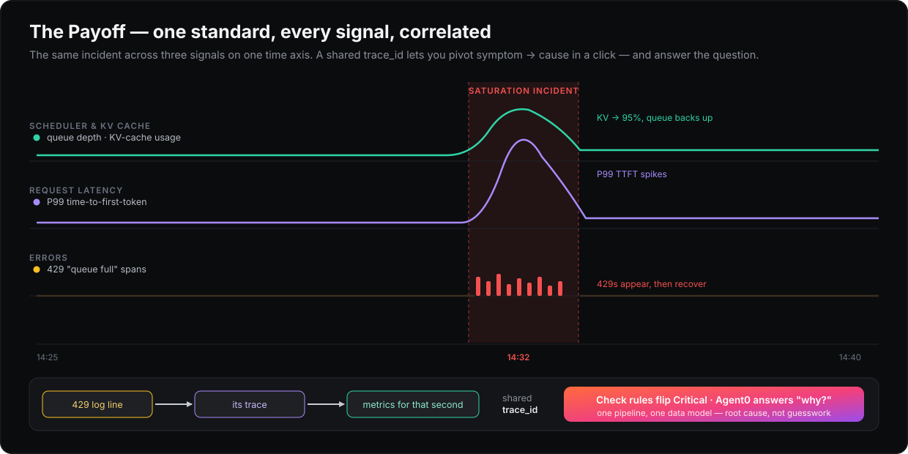

# LLM Inference Observatory

**OpenTelemetry-native observability for GPU LLM inference** — a reference
architecture and reusable POC for vLLM + NVIDIA DCGM workloads.

One standard, every signal: engine metrics, GPU fleet metrics, and per-request
traces following the [OTel GenAI semantic conventions](https://opentelemetry.io/docs/specs/semconv/gen-ai/)
flow through a single OpenTelemetry Collector. No proprietary agents, no
vendor-specific data models, dashboards as code.

<p align="center">
  
</p>

## The problem

GPU inference is the fastest-growing telemetry source in most platform estates,
and its failure modes are unusual: saturation shows up as queue growth and
KV-cache pressure long before GPU utilization looks alarming, and the
user-facing SLI (time to first token) is a *composition* of queueing, prefill,
and decode. In practice that telemetry ends up scattered across tools with no
shared data model — so when latency spikes, there's no way to pivot from the
symptom to the request that caused it.

<p align="center">
  
</p>

This repo models all of it in OpenTelemetry natively — one pipeline, one data
model, every signal correlated — and doubles as a demo environment that runs on
any laptop, because the telemetry sources are simulated with full fidelity.

<p align="center">
  
</p>

## Quickstart (10 minutes, no GPU required)

```bash
git clone <this-repo> && cd llm-inference-observatory-dash0

cp .env.example .env   # optional: paste OTLP endpoint + token (e.g. Dash0)
make up                # docker compose up -d --build

# Inspect the stream locally (works with or without a backend account):
make logs              # collector debug exporter
make validate          # compose check + sample scraped metrics + health
make demo-script       # printed TTFT investigation narrative
```

Import the Perses dashboards under [`dashboards/perses/`](dashboards/perses/)
into your backend — kept in git, deployable through a release pipeline rather
than built by hand in a UI.

## Why Dash0

This project is **OpenTelemetry-native first**. The data model, collector, and
dashboards do not depend on a proprietary format.

[Dash0](https://www.dash0.com) is the OTLP backend we use for demos because it
keeps that open model intact: Perses dashboards as code, check rules from
`PrometheusRule`, and a Kubernetes operator that lights up infrastructure
alongside Services/Tracing — without installing a second agent stack on the
inference node. A free trial works for the quickstart; without credentials the
collector's `debug` exporter still shows the full stream locally.

## What you'll see

The simulated workload is a small queueing model, not random noise:

- **Poisson arrivals** over a sped-up diurnal curve, with a realistic traffic
  mix (short chat / long-prompt RAG / long generations → distinct token
  distributions).
- **A bounded decode batch**, so queue depth drives time-to-first-token
  exactly as it does in a real engine; inter-token latency degrades with
  batch size.
- **Scenarios** via `SCENARIO=steady|burst|recovery` (`make scenario-burst`,
  etc.). Default `burst`: a saturation incident every ~7 minutes (90s, 3×).
  Queue climbs → KV-cache hits ~95% → P99 TTFT spikes → 429-status error spans
  — then it drains and recovers.

Demo script: ask *"why did P99 time-to-first-token spike five minutes ago?"*
The answer is written across correlated metrics and traces from one pipeline —
queue-time histograms, KV cache pressure, and the individual rejected requests
as `gen_ai.*` spans.

## Telemetry data model

| Signal | Convention | Examples |
|---|---|---|
| Request traces | OTel GenAI semconv | `gen_ai.usage.input_tokens`, `gen_ai.server.time_to_first_token`, `gen_ai.response.finish_reasons`, TTFT span event |
| Engine metrics | vLLM Prometheus names | `vllm:time_to_first_token_seconds`, `vllm:num_requests_waiting`, `vllm:kv_cache_usage_perc` |
| GPU metrics | DCGM exporter names | `DCGM_FI_DEV_GPU_UTIL`, `DCGM_FI_DEV_FB_USED`, `DCGM_FI_DEV_POWER_USAGE` |
| Logs | OTLP logs, trace-correlated | vLLM-style engine throughput lines, per-request outcomes, preemption warnings; each request log carries its `trace_id` for log→trace pivot |
| Resources | OTel resource semconv | `service.namespace=llm-inference`, `deployment.environment.name=demo` |

Full inventory: [docs/metrics-catalog.md](docs/metrics-catalog.md).
Rationale: [docs/architecture.md](docs/architecture.md).

## Demo mode vs GPU mode

The collector config, data model, and dashboards are **identical** in both
modes — only the scrape targets change.

| | Demo mode (`make up`) | GPU mode (`make gpu-up`) |
|---|---|---|
| Engine metrics | simulator, vLLM-exact names | real `vllm/vllm-openai` |
| GPU metrics | simulator, DCGM-exact names | real `dcgm-exporter` |
| Traces | simulator, GenAI semconv | vLLM `--otlp-traces-endpoint` |
| Hardware | any laptop | NVIDIA host |

GPU mode details: [docs/gpu-mode.md](docs/gpu-mode.md).
Drive traffic with `make loadgen` once the real engine is up.

## Production-shaped Kubernetes deployment

`docker compose up` is the quickstart. For a cluster-shaped demo — infrastructure
monitoring and check rules next to Services/Tracing — deploy onto local k3d:

```bash
make k8s-up      # k3d cluster + operator + workloads + check rules
make k8s-status
make k8s-nuke    # tear it all down
```

Full details: [k8s/README.md](k8s/README.md).

## Repo layout

```
collector/config.yaml        one collector pipeline for both modes
simulator/                   vLLM+DCGM-faithful workload simulator
scripts/loadgen.py           OpenAI-compatible client for GPU mode
docker-compose.yml           demo mode
docker-compose.gpu.yml       GPU overlay (real vLLM + dcgm-exporter)
k8s/                         production-shaped k3d deployment + check rules
dashboards/perses/           dashboards as code (Perses spec)
docs/                        architecture, GPU mode, metrics catalog
tests/                       simulator unit tests
```

## Roadmap

- Query the incident through an MCP server from an AI agent
  ("agents query the same data as humans")
- Add the [fake GPU operator](https://github.com/run-ai/fake-gpu-operator) to
  the k8s deployment for simulated GPU node topology
- Manage check rules and dashboards via Terraform as an alternative to the
  operator path
