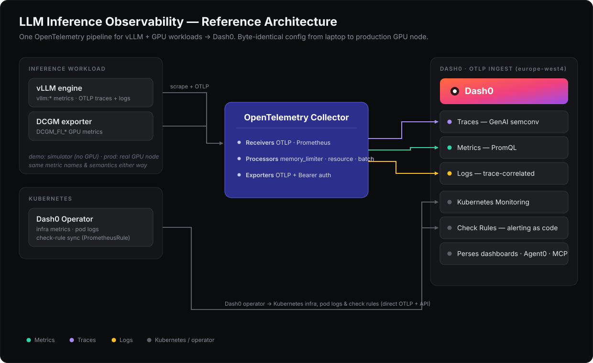

# Dash0 integration architecture



## Original real-engine capture

The September 27 run served `google/gemma-4-12B-it` at revision `707f0a3b8a3c7ad586ed01e27eafbad8a27dd0f7` with vLLM 0.30.0 on an H100 80GB. The inference endpoint listened on the Pod's loopback address. A local SSH forward carried client requests; a reverse forward carried engine OTLP to the laptop's archive receiver. Credentials for the original Logfire destination stayed on the laptop.

```text
workload root (scenario)
  └─ client chat span (entire streaming response)
       └─ native vLLM llm_request (completed generations)
```

The application used an explicit Logfire span and OpenTelemetry propagation. It injected W3C `traceparent` into each OpenAI-compatible request. It did not add automatic OpenAI instrumentation on top. Every completed request's native parent ID matched the client span ID, and native token counts matched returned final usage.

Dash0 currently labels the native operation as `UNKNOWN` because this vLLM capture does not carry the full operation-classification attribute set Dash0 expects. Its timing attributes and parent context remain available. The replay preserves that schema rather than rewriting the source evidence.

The native engine span is a request envelope. Queue, prefill, decode, total duration and engine TTFT are attributes in seconds. This is not a GPU kernel profile or separate scheduler-stage trace. The client first-content measurement additionally includes transport; it is not interchangeable with native TTFT.

The workload ran from **08:20:59.518553 to 08:23:17.751766 UTC**. There were two separate smoke requests, excluded from this repository's Dash0 replay. The model and Pod were stopped after capture and backup.

## Portable archive

The receiver saved original OTLP protobuf batches, decoded inspection JSON and receipts. Additional files preserve request/chunk records, request indexes, startup logs, exact versions, Prometheus snapshots and GPU CSV. SHA-256 manifests protect the source files from unnoticed changes.

The raw archive is private local evidence, not a repository fixture. Original prompts, host metadata and stack paths are not needed in a public README. Public summaries retain counts, timing results, source provenance and trace mappings.

## Replay transformations

`capture.py prepare` consumes this archive without modifying it. It selects the recorded main trace IDs, excludes Logfire pending-span records and rejects duplicate final spans. For each replay it generates distinct trace IDs and applies one nanosecond timestamp offset to traces, events, logs and metrics. Span/parent IDs, durations and original error status remain unchanged. Links pointing to a replayed trace use that trace's remapped ID.

Every resource carries `inference.replay.id`, `inference.capture.id`, `observatory.replayed=true`, `inference.source=real-h100-capture` and `inference.replay.shift_ns`. Each span also preserves its original trace ID. The generated manifest records the mapping, windows and payload checksums.

| Signal | Source | Treatment |
|---|---|---|
| Traces | Original client + native vLLM OTLP | Preserve recorded content; shift time/remap trace IDs |
| Outcome logs | Archived request JSONL | One correlated OTLP log per request; source explicitly marked |
| Client timing gauges | Saved first-content and duration measurements | One observed point per available measurement |
| Engine timing gauges | Native queue/prefill/decode attributes | Derived observation, not a new span |
| GPU gauges | Timestamped `nvidia-smi` CSV | Five values per actual sample; MiB converted to bytes |
| Original Prometheus snapshots | Before/after each scenario | Retained in archive; not expanded into scrape history |

Request gauges include OTLP exemplars pointing to the client span. This run verifies the metric query path and the log-to-trace pivot; it does not claim a verified exemplar click path in Dash0's UI.

## Collector boundary

[`collector/replay.yaml`](../collector/replay.yaml) receives OTLP/HTTP on the container's port 4318. Compose publishes it on laptop loopback port 24318. Memory limiting precedes batching. The OTLP exporter uses Dash0's regional gRPC endpoint, TLS, a bearer token and the dataset header. There are separate trace, metric and log pipelines. This path does not scrape a simulator or connect to the stopped GPU.

Local HTTP acceptance is only the first checkpoint. `verify_dash0.py` queries all six hosted traces, compares the exact span sets, checks parent IDs and durations, verifies the error event, checks every log's trace/span pair, and queries GPU utilization. The verified replay has 123 spans, 61 log correlations and a 100% GPU sample peak.

## Visualization semantics

The Perses dashboard is generated from code and applied with Dash0's documented API. OTel metric names normalize in Dash0's Prometheus API: dots become underscores and units contribute suffixes such as `_seconds`, `_bytes` and `_percent`. Queries are scoped by replay ID.

A 15-second rolling maximum bounds each displayed observation. It avoids holding a finished request's last value for the default Prometheus lookback window. It is neither a latency quantile nor a continuous load test. Detailed request timing should be read from the native span or archive; dashboard downsampling can hide individual samples.

Service-level RED summaries have different denominators from the workload report. Dash0 sees six client entry/root spans and 56 native server requests. The 61 client chat spans are internal spans below the workload roots. Consequently the client service's top-level error percentage can be zero while an internal chat span correctly records an error. Use span/log filters to investigate the request outcome.

## A future live pipeline

For a new GPU run, reuse the actual [capture tools at the recorded project revision](https://github.com/rudrakshkarpe/logfire-inference-lab/tree/cfcfc210ce790e72a29d634f9c80cbd6b95bf8ad/scripts/gpu). Preserve the archive before publishing telemetry. The stored `start_vllm_gemma12.sh` is the authoritative launch command for this capture.

A live Dash0 deployment can direct the same OTLP producers into the Collector and add independently validated Prometheus/DCGM receivers. It must also capture resource identity, engine version, sampling policy, ongoing request counters/histograms and cancellation behavior. This repository's older GPU/Kubernetes examples are starting points, not evidence that those paths were tested on this H100. Never infer real DCGM, continuous KV-cache utilization, production SLO compliance or complete cancellation tracing from the replay.
