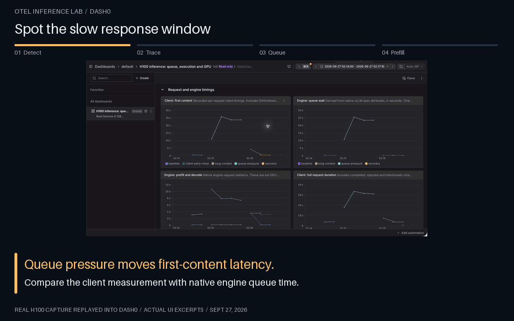
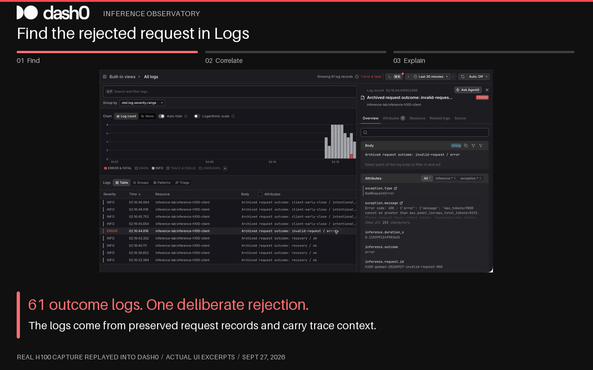
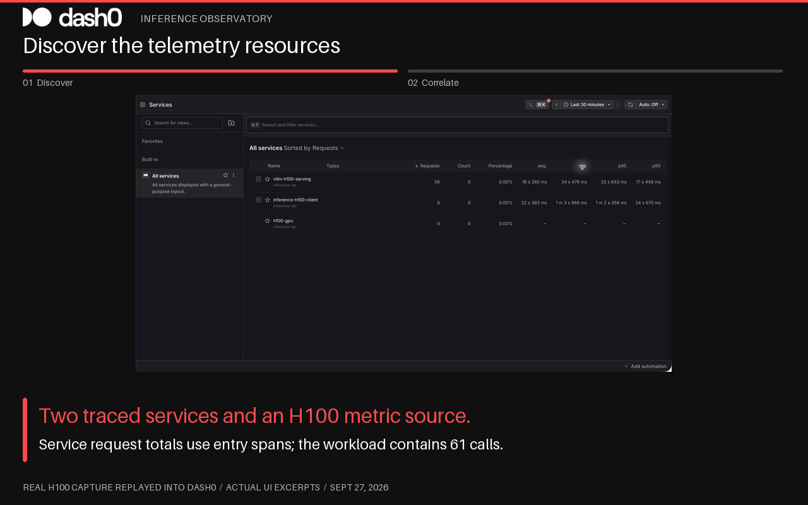

# Investigating the captured inference workload

Use `inference.replay.id = dash0-h100-20260927` and the fixed time window in the [setup guide](dash0-replay.md). The UI walkthroughs are annotated screenshots, not fabricated dashboards. Source PNGs are committed alongside the GIFs; only browser chrome is cropped. The generator magnifies excerpts and adds captions/highlight outlines without changing values.

## 1. Diagnose a slow first response

Open the H100 dashboard and compare client first-content time with engine queue wait. Open Tracing, select the queue-pressure workload root and choose **View full trace**. Its 65 spans contain one root, 32 client spans and 32 native engine spans. Dash0 may collapse repeated span shapes; “Reveal duplicate spans” is a display grouping, not evidence that the replay emitted duplicates.

Select the native request whose `gen_ai.request.id` ends in `queue-pressure-028`. In Attributes, filter `gen_ai.latency`. Queue is 23.045782 s, prefill 0.053106 s and decode 6.108001 s. Use the Trace graph to inspect the client/serving resource relationship. The archive and hosted API establish the actual parent IDs even when repeated rows are collapsed in the UI.

Compare with long-context request `000`: 3.444381 s prefill, 0.000055943 s queue, 3.483005 s decode. This workload supplied roughly 6,400 input tokens per request with prefix caching disabled. Prompt processing, rather than admission wait, explains the slow first response in that request.

The next experiment would vary one factor at a time: scheduler concurrency for queueing, or prompt size/prefix caching for prefill. That experiment has not been run here.

## 2. Explain an error and correlate its log

Open Logging and select the single `ERROR` request outcome. Read `exception.message`: `max_tokens=9000` exceeds `max_model_len=8192`. The log carries the client's original span ID and remapped trace ID. Use **Span Context → View full trace** to inspect the error span and exception event. The trace has only the scenario root and client span; there is no completed native generation span.

The error is an expected validation test. An appropriate application response is to validate the output budget against the selected model's context limit and actual prompt budget before sending the request. This run does not test automatic retries, failover or mid-stream error handling.

Do not count the four `intentional_early_close` records as completed generation. They have no final usage. A non-error span status means the client did not raise; it does not prove the model finished.

## 3. Connect request behavior to GPU context

Services lists the inference client, vLLM serving resource and a metric-only H100 source. The dashboard shows time-aligned utilization, memory, power and temperature. The 15-second rolling maxima preserve the observed utilization spike, but a GPU spike is not, by itself, a diagnosis of admission queueing or KV-cache exhaustion.

The screenshot's `h100-gpu` request count is zero because that resource emits only measurements. The client service's count of six represents workload roots; use the 61 outcome logs for request accounting. Metrics are time-correlated with the trace window rather than attached to a unique inference request.

## Feature coverage and limits

| Dash0 capability | What this project exercised | Limit |
|---|---|---|
| OTLP traces, metrics and logs | All three ingested through one Collector | Bounded replay, not a continuously running service |
| Distributed tracing | Full trace, native attributes, resource graph and preserved parent links | No fabricated scheduler or GPU-kernel spans |
| Error investigation | Actual error status, exception and log-to-trace pivot | Intentional pre-generation rejection only |
| Logging | Severity, request outcome attributes and trace context | Logs derived from archived outcomes, not engine console logs |
| Services and resources | Client, serving and GPU inventory | Entry-span RED counts differ from workload counts |
| Perses dashboards | Eight versioned panels applied through API | Rolling maxima, no request histogram quantiles |
| PromQL | Read-back query and generated dashboard expressions | Evaluation points can differ from source sample counts |
| Metric exemplars | Trace/span context encoded in outgoing request gauges | UI exemplar navigation not verified |
| Alert checks and SLOs | Optional old examples retained separately | No live SLO evaluation or notification delivery claimed |
| Kubernetes / DCGM | Separate deployment examples | Neither deployed nor measured in this capture |
| Agent0, synthetic monitoring, browser RUM, cloud integrations | No result claimed | Require an appropriate live workload and separate validation |

It would be misleading to force every product feature into this short archive. A useful next phase is a new real serving deployment with ongoing request counters/histograms, verified live GPU scraping and a deliberately tested alert route. Preserve a new versioned capture for that phase rather than blending it into this one.
